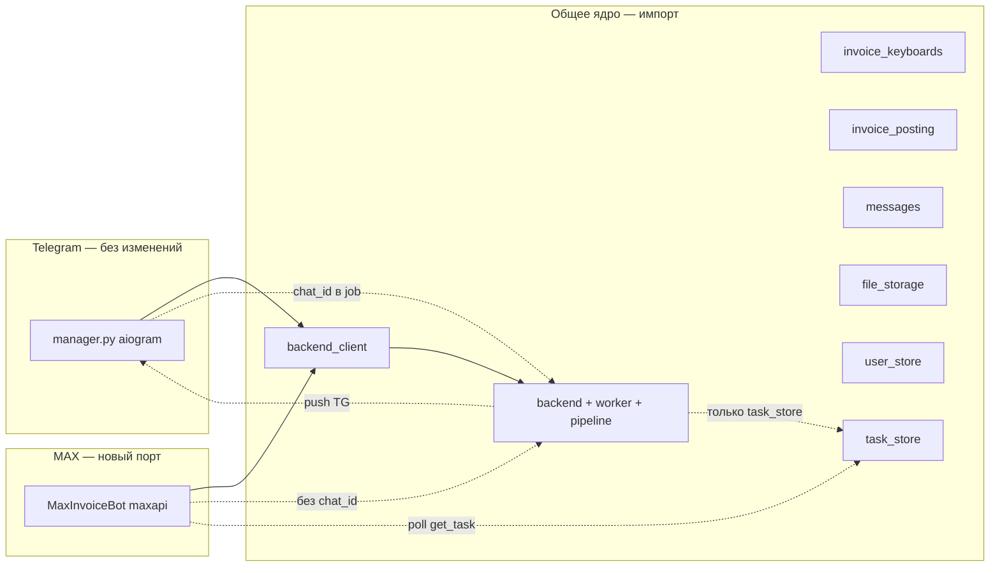

# Invoice bot → MAX: план параллельного порта

> **Ветка:** `feature/channel-max`
> **Статус:** Phase 2 MVP реализован (2026-06-22). Живой прогон с токеном — следующий шаг.
> **Модель:** отдельная инфраструктура «по шаблону» grok bridges; **TG не трогаем**.

## 0. Решение владельца

- **Не переписывать Telegram** (`app/bot/manager.py`, `app/tasks.py` — без рефакторинга).
- **Полный порт для MAX** — свой процесс, свой бот, свой entrypoint.
- **Переиспользование** общих модулей ядра (backend, pipeline, keyboards, messages).
- **Отдельный проект** — опционально на Phase 2+, когда порт стабилизируется.

## 1. Шаблон: как уже сделано для Grok

| | Telegram | MAX |
|---|----------|-----|
| Grok bridge | `experiments/grok_telegram_bridge/` | `experiments/grok_max_bridge/` |
| Invoice bot (цель) | `app/bot/manager.py` (канон, не трогаем) | `experiments/max_invoice_bot/` (новый трек) |
| Токен | `TELEGRAM_BOT_TOKEN` | `MAX_INVOICE_BOT_TOKEN` |
| Shared | pipeline, config, … | те же + `app.bot.*` как библиотека |

Invoice MAX — **не** эксперимент с Grok, но **та же схема изоляции**: отдельная папка, отдельный polling, общее ядро.

## 2. Архитектура (два параллельных бота)



### Как MAX получает результат **без правок worker**

1. MAX-бот шлёт файл в `/process` **без** `chat_id` (поле опционально в `api.py` и `backend_client`).
2. Worker обрабатывает как обычно, пишет `mark_done` / `mark_error` в `task_store`.
3. Блок `if chat_id:` в `tasks.py` **не срабатывает** — в TG ничего не меняется.
4. MAX-бот после enqueue держит `request_id` и **poll** `get_task(request_id)` → сам шлёт пользователю в MAX (edit status + финал + клавиатура).

Это отдельная доставка только для MAX, не «нейтрализация воркера».

| | Telegram (как сейчас) | MAX (новое) |
|---|----------------------|-------------|
| Уведомление о результате | Worker → push в TG API | MAX-бот → pull из `task_store` |
| Изменения в `tasks.py` | **Нет** | **Нет** |
| Status «обрабатываю…» | Worker edit по `status_message_id` | MAX-бот edit своего сообщения + poll |

## 3. Что НЕ делаем

| Подход | Почему |
|--------|--------|
| Extract `InvoiceBotController` из `manager.py` | = переписывание TG |
| `channels/notify.py` в worker | = трогать `tasks.py` |
| `if channel == max` в `manager.py` | заплатки в каноне |
| Слепой копипаст 1900 строк | два расходящихся бота |

## 4. Что делаем

### 4.1 Структура (целевая)

```
experiments/max_invoice_bot/
  __init__.py
  __main__.py          # python -m experiments.max_invoice_bot
  config.py            # MAX_INVOICE_BOT_* (или читать из app.config)
  bot.py               # MaxInvoiceBot — порт логики с manager.py
  keyboards.py         # dict invoice_keyboards → maxapi InlineKeyboard
  attachments.py       # скачивание файлов MAX → bytes
  task_watcher.py      # poll task_store, deliver result в MAX
  ARCHITECTURE.md
  README.md

# Переиспользуем без копирования:
app/bot/backend_client.py
app/bot/invoice_keyboards.py
app/bot/invoice_posting.py
app/bot/messages.py
app/bot/file_storage.py
app/services/user_store.py   # ключ max:{user_id}
app/task_store.py
app/config.py                # BACKEND_URL, IIKO, OPENAI…
```

Каркас Phase 0 (`app/channels/`, `app/entrypoints/max_bot.py`) — **переедет** в `experiments/max_invoice_bot/` при Phase 1.

`app/channels/protocol.py` — опционально как внутренняя абстракция MAX-бота (не общий слой с TG).

### 4.2 user_id

TG и MAX — разные id. Credentials iiko: ключ `max:{user_id}` в `user_store` (расширение store или thin wrapper в max_invoice_bot). TG-пользователи не затронуты.

### 4.3 Портирование логики

Не рефакторим `manager.py` — **читаем как спецификацию** и переносим сценарии в `experiments/max_invoice_bot/bot.py`:

1. auth, status
2. files, pending, split
3. callbacks (те же payload из `invoice_keyboards`)
4. post-recognition, edit, iiko actions

Дублирование state-machine допустимо на MVP; синхронизация фич — ручная (как TG ↔ grok bridges).

**Пачка файлов (pending UI):** тексты кнопок портированы, механика чата — нет (см. инцидент 2026-07-05). Детальная спека, FSM и PR-план: [`MAX_BATCH_UPLOAD_UX_DESIGN.md`](MAX_BATCH_UPLOAD_UX_DESIGN.md). Эталон в TG: `_send_mode_keyboard_to_chat`, `_finalize_media_group` в `app/bot/manager.py`.

### 4.4 Запуск

```env
MAX_INVOICE_BOT_TOKEN=...
BACKEND_URL=http://127.0.0.1:8000
# остальной .env как для TG
```

```powershell
.\.venv\Scripts\python.exe -m experiments.max_invoice_bot
```

Backend + worker — те же процессы, что для TG (`dev_run_all` без MAX-бота или отдельный PyCharm config).

## 5. Отдельный проект — когда и как

| Этап | Где живёт | Когда |
|------|-----------|-------|
| **A. Сейчас** | `experiments/max_invoice_bot/` в этом репо | MVP, один `.env`, общий worker |
| **B. Потом** | pip-пакет `invoice-bot-core` + репо `invoice-bot-max` | стабильный порт, отдельный деплой |
| **C. Никогда не обязательно** | если MAX остаётся side-channel для одного клиента | monorepo достаточно |

**Критерий выноса в отдельный проект:** MAX-бот деплоится на другой машине без TG-токена и без `app/bot/manager.py`.

Выносим в core-пакет: `backend_client`, `invoice_keyboards`, `invoice_posting`, `messages`, типы payload — не весь `app/`.

## 6. Фазы

### Phase 0 ✅

- [x] План (этот документ)
- [x] Черновик protocol / config (мигрирует в experiments)

### Phase 1 — Scaffold `experiments/max_invoice_bot/`

- [ ] Перенести entrypoint из `app/entrypoints/max_bot.py`
- [ ] `config.py`, `README`, `ARCHITECTURE.md`
- [ ] `task_watcher.py` — poll `get_task`, unit-тест с mock
- [ ] `keyboards.py` — `invoice_keyboards` dict → maxapi

### Phase 2 — MVP сценарии

- [ ] `/start` + iiko auth
- [ ] один файл → `/process` без chat_id → watcher → результат + `build_invoice_actions`
- [ ] `/status`

### Phase 3 — Parity с TG

- [ ] pending / split / batch
- [ ] post-recognition callbacks (`inv:*`, edit)
- [ ] ручной прогон `BOT_COMMAND_MATRIX.md`

### Phase 4 — Dev / docs

- [ ] `scripts/run_max_invoice_bot.ps1`
- [ ] PyCharm `5. max invoice bot`
- [ ] `AGENT_HANDOFF.md`

### Phase 5 (опционально)

- [ ] Вынести `invoice-bot-core`
- [ ] Отдельный репозиторий

## 7. Риски

| Риск | Обход без правок TG |
|------|---------------------|
| Poll latency | interval 1–2s, edit одного status-сообщения |
| Два бота, две копии state-machine | принять на MVP; фиксы в MAX по мере нахождения |
| Альбомы в MAX | проверить API; fallback «по одному файлу» |
| Worker не шлёт progress | только MAX-бот показывает «жду…» локально |

## 8. Definition of Done

1. `MAX_INVOICE_BOT_TOKEN` + backend/worker → auth → PDF → распознавание → кнопки «Оприходовать».
2. **Ноль изменений** в `manager.py` и логике TG push в `tasks.py`.
3. Тесты: `task_watcher`, keyboards; ручной MAX прогон.

## 9. Следующий шаг

Phase 1: создать `experiments/max_invoice_bot/` по шаблону `grok_max_bridge`, перенести каркас, реализовать `task_watcher` + один happy-path файл.
