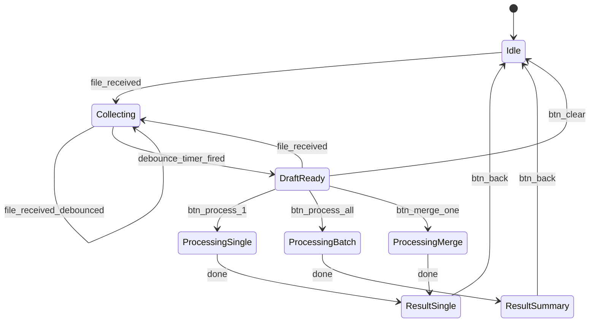
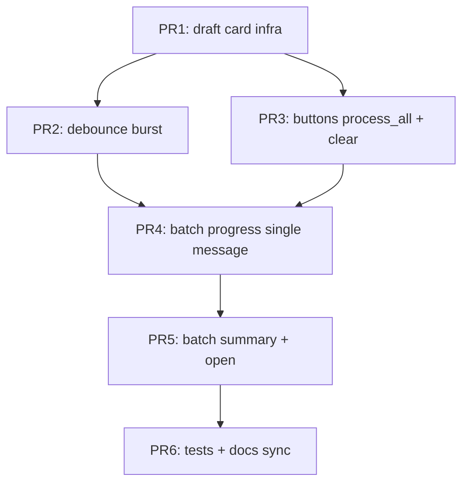

# MAX: UX пачки файлов (черновик → обработка → сводка)

> **Статус:** design approved by owner (2026-07-05), **код не меняли** — только спецификация  
> **Ветка:** `feature/max-batch-ux` (мерж в `feature/channel-max` после PR1+)  
> **Канал:** MAX invoice bot (`experiments/max_invoice_bot/`)  
> **Эталон:** Telegram `app/bot/manager.py` (механика чата, не тексты)  
> **Инцидент:** `logs/dev_stack/5.log` 2026-07-05 22:21 — 10 файлов за 11 с → лавина reply-сообщений

---

## 1. Проблема

### 1.1 Симптом (что видит клиент)

При быстрой отправке нескольких файлов подряд (фото накладных, PDF) в MAX:

- на **каждый** файл бот отвечает **новым** сообщением (`message.answer()`);
- предыдущая карточка черновика **бланится** (`edit text=" "`), а не удаляется;
- в ленте остаётся цепочка пустышек + дублирующихся кнопок «Собрано файлов: N».

При 10 файлах — визуальный шум, непонятно какое сообщение актуально.

### 1.2 Корневая причина (код)

| Механизм | Telegram (`manager.py`) | MAX (`experiments/max_invoice_bot/bot.py`) |
|----------|-------------------------|------------------------------------------|
| Карточка черновика | `bot.send_message(chat_id)` | `message.answer()` — reply на каждый файл |
| Обновление счётчика | новое сообщение + **`delete_message`** старого | новое reply + **blank** старого `pending_prompt` |
| Альбом / burst | `media_group_id` + debounce **2 с** → одна карточка | нет debounce, нет media_group |
| Инвариант UX | **одно** актуальное служебное сообщение в чате | N reply + (N−1) пустышек |

Тексты кнопок (`Msg.PENDING_*`) скопированы; **механика «липкой карточки»** — нет.

### 1.3 Вне scope этого дизайна

- Распознавание (race, SotaOCR, vision) — не меняем.
- Worker / pipeline — не меняем.
- Telegram — **не рефакторим**; только выносим общий паттерн, если появится shared helper.
- Спец-обработка CSV/не-накладных — отдельный тикет (preflight по типу файла).

---

## 2. Цели и не-цели

### Цели

1. **Один** служебный UI-элемент в чате на фазу «черновик» и **один** на фазу «обработка пакета».
2. Поведение MAX **паритетно** TG по инварианту: debounce burst, замена карточки, edit-in-place при обработке.
3. Явный выбор клиента: **несколько накладных** vs **страницы одной накладной**.
4. Результат пакета — **компактная сводка**, детали по кнопке «Открыть».

### Не-цели (v1)

- Авто-определение «это одна накладная» без кнопки (можно v2 по эвристике burst < 30 с).
- Полный extract `InvoiceBotController` из `manager.py` (см. AGENT_HANDOFF §64.4).
- Media album API MAX — если появится нативно, подключим отдельно.

---

## 3. Персона клиента и сценарии

Клиент — владелец/закупщик ресторана или кофейни. Отправляет **фото/PDF накладных**, не служебные файлы.

| # | Сценарий | Действия клиента | Ожидаемый UX |
|---|----------|------------------|--------------|
| A | Одна накладная | 1 PDF или 1–2 фото | 1 карточка → `Обработать` → 1 результат |
| B | Длинная накладная | 3–6 фото **одного** документа | burst → черновик → `Объединить в одну` → 1 результат |
| C | Несколько поставщиков | 2–5 **разных** накладных за сессию | черновик → `Обработать все (N)` → сводка N строк |
| D | Случайный дубль | то же фото дважды | hint внутри карточки, без отдельного сообщения |
| E | PDF | один PDF | выбор ⚡/🎯 в **той же** карточке, затем обработка |

---

## 4. Принцип UX: «липкая карточка»



**Правило:** в любой момент в чате не более **одной** карточки черновика (`draft_card_message_id`) и **одной** карточки прогресса (`progress_message_id`).

---

## 5. Таблица состояний (FSM)

Состояние хранится **per user** (`store_key` = `max:{uid}`), поля в памяти бота (+ файлы в `data/pending/max_{uid}/`).

| Состояние | `pending_files` | UI-сообщение | Кнопки | Переходы |
|-----------|-----------------|--------------|--------|----------|
| `idle` | 0 | — | — | `file_received` → `collecting` |
| `collecting` | 1..N (растёт) | debounce: **не** спамить; опционально «…» | — | timer 2–3 с → `draft_ready`; ещё файл → reset timer |
| `draft_ready` | 1 | «📄 Файл в черновике» | `[▶ Обработать]` `[✖ Очистить]` | `process` → `processing_single`; `clear` → `idle` |
| `draft_ready` | 2..N | «📦 Черновик · N файлов» + список (до 5 имён) | `[▶ Обработать все (N)]` `[📎 Одна накладная]` `[✖ Очистить]` `[🧹 Дедуп]`* | `process_all` → `processing_batch`; `merge_one` → `processing_merge`; `dedup` → остаёмся, refresh card |
| `draft_pdf` | 1 (.pdf) | «📄 PDF · режим: …» | `[⚡ Быстро]` `[🎯 Точно]` + как single | после pdf choice → `processing_single` |
| `processing_single` | 0 (очищен pending) | edit draft → «⏳ Обработка…» + stages | — | watcher → `result_single` / `result_error` |
| `processing_batch` | 0 | «⏳ Пакет · i/N · …» | — | все jobs terminal → `result_summary` |
| `processing_merge` | 0 | «⏳ Объединяю N файлов…» | — | batch done → `result_single` |
| `result_single` | 0 | карточка накладной (как сейчас) | inv actions | `back` → `idle` |
| `result_summary` | 0 | сводка N строк | `[Открыть #k]` / `/status` | drill-down → `result_single` |
| `result_error` | 0 | ошибка + retry | retry | retry → `processing_*` |

\* `[🧹 Дедуп]` — только если `duplicate_count > 0` (как в TG).

### События (входы FSM)

| Событие | Источник | Действие |
|---------|----------|----------|
| `file_received` | `on_message` / attachment | store pending; schedule debounce task |
| `debounce_fired` | asyncio timer | edit/create **одну** `draft_card`; cancel prior debounce |
| `btn_process` | callback `mode:process` | `_process_pending_as_batch` (1 file) |
| `btn_process_all` | callback `mode:process_all` **(новый)** | loop / queue N jobs; один progress |
| `btn_merge_one` | callback `mode:merge` | `_process_pending_as_merged_batch` |
| `btn_clear` | callback `mode:clear` **(новый)** | clear pending dir; delete draft card → `idle` |
| `btn_dedup` | callback `mode:dedup` | dedup dir; refresh draft card |
| `job_terminal` | `task_watcher` | update progress or finalize summary |

---

## 6. Макеты сообщений

### 6.1 Черновик — 1 файл

```
📄 Файл в черновике
invoice_photo.jpg

Можно отправить ещё фото или PDF.

[▶ Обработать]  [✖ Очистить]
```

### 6.2 Черновик — N файлов

```
📦 Черновик · 4 файла

• page_1.jpg
• page_2.jpg
• page_3.jpg
• meatprom.pdf

Добавьте ещё или выберите действие.

[▶ Обработать все (4)]
[📎 Одна накладная — объединить]
[✖ Очистить]
```

Дубликаты (если есть):

```
⚠️ Пропущено дубликатов: 1 (уже в черновике)
```

Строка **внутри** карточки, не отдельным `SOFT_DUP_*` reply.

### 6.3 Прогресс — один файл

Та же карточка редактируется (`task_watcher` + `PROCESSING_STAGES`):

```
⏳ Обработка…
📄 Читаю документ…
```

### 6.4 Прогресс — пакет

```
⏳ Пакет · 2/4
МясоПром · обработка…
```

### 6.5 Сводка пакета

```
✅ Готово: 3 из 4

1. МясоПром · №40066787 · 12 поз. · 52 405 ₽  [Открыть]
2. Оливко · №01518 · 8 поз. · 3 420 ₽         [Открыть]
3. Metro · №99102 · 5 поз. · 8 100 ₽          [Открыть]
4. scan_blur.jpg — ❌ не распознана             [Повторить]

Все заявки: /status
```

Детальная карточка с «Оприходовать» — только после `[Открыть]`.

---

## 7. Портирование из Telegram (чеклист реализации)

| # | TG (`manager.py`) | MAX (сделать) | Файлы |
|---|-------------------|---------------|-------|
| 1 | `_send_mode_keyboard_to_chat` | `send_to_user(chat_id)` + хранить `draft_card_message_id` | `bot.py`, `messaging.py` |
| 2 | `delete_message(old_id)` | `edit` того же id **или** delete если MAX API позволит | `bot.py` |
| 3 | `_finalize_media_group` debounce 2 с | `_finalize_pending_burst(store_key)` debounce 2–3 с | `bot.py` |
| 4 | `_pending_chats[user_id]` | уже есть `chat_id` из message; явный map | `bot.py` |
| 5 | callback edit `status_message` | уже частично; унифицировать для draft | `bot.py`, `task_watcher.py` |
| 6 | `mode:process` при 1 файле | без изменений смысла | — |
| 7 | только `mode:merge` при 2+ | **добавить** `mode:process_all` | `messages.py`, keyboards |
| 8 | `FILE_DONE` × N в одном edit | заменить на **сводку** + batch progress | `bot.py`, `messages.py` |
| 9 | тесты `test_pending_prompt_*` | порт в `tests/test_max_invoice_bot.py` | tests |

### Новые константы (`app/bot/messages.py`)

| Ключ | Назначение |
|------|------------|
| `DRAFT_SINGLE` | карточка 1 файла (можно заменить `PENDING_SINGLE`) |
| `DRAFT_MULTI` | карточка N файлов |
| `DRAFT_FILE_LINE` | `• {filename}` |
| `DRAFT_DUP_INLINE` | inline hint дубликатов |
| `BTN_PROCESS_ALL` | `▶ Обработать все ({count})` |
| `BTN_MERGE_ONE` | `📎 Одна накладная — объединить` |
| `BTN_CLEAR_DRAFT` | `✖ Очистить` |
| `BATCH_PROGRESS` | `⏳ Пакет · {index}/{total}` |
| `BATCH_SUMMARY_HEADER` | `✅ Готово: {ok} из {total}` |
| `BATCH_SUMMARY_ROW_OK` | строка успеха |
| `BATCH_SUMMARY_ROW_FAIL` | строка ошибки |

Callback data:

| data | Действие |
|------|----------|
| `mode:process` | 1 файл или все по отдельности (если 1 в pending) |
| `mode:process_all` | **новый** — N отдельных jobs |
| `mode:merge` | merged batch (страницы одной) |
| `mode:clear` | **новый** — сброс черновика |
| `mode:dedup` | без изменений |
| `batch:open:{request_id}` | **новый** — drill-down из сводки |

---

## 8. План PR (DAG)



| PR | Scope | Критерий готовности |
|----|-------|---------------------|
| **PR1** | `draft_card_message_id`, `send_to_user` вместо `answer` для pending; убрать blank-reply | 5 файлов подряд → **1** карточка в чате |
| **PR2** | debounce 2–3 с на серию `file_received` | burst 5 фото за 3 с → **1** обновление счётчика |
| **PR3** | кнопки `process_all`, `clear`; тексты `DRAFT_*` | 3 файла → две явные кнопки merge vs all |
| **PR4** | `processing_batch` — один progress edit | 3 накладные → один progress, не 3 reply |
| **PR5** | `result_summary` + `batch:open:{id}` | сводка + открытие карточки |
| **PR6** | unittest + AGENT_HANDOFF + MEMORY_BANK | `test_max_invoice_bot` green |

**Оценка:** PR1–PR3 — высокий приоритет (фикс инцидента 2026-07-05). PR4–PR5 — следом.

---

## 9. Тест-кейсы (ручные + авто)

| ID | Шаги | Ожидание |
|----|------|----------|
| T1 | 1 фото → Обработать | 1 draft → 1 progress → 1 result |
| T2 | 5 фото за 5 с | 1 draft, счётчик 5, без пустышек |
| T3 | 3 PDF → Обработать все | 1 progress → сводка 3 строк |
| T4 | 4 фото → Одна накладная | 1 merged job → 1 result |
| T5 | дубль фото | hint в карточке, файлов N не +2 |
| T6 | Очистить черновик | pending пуст, карточка исчезла |
| T7 | PDF → ⚡ Быстро | режим в той же карточке |

Авто: mock `send_to_user` / edit — считать вызовы; burst 5 attachments → `send_to_user` call count ≤ 2.

---

## 10. Риски и открытые вопросы

| Риск | Митигация |
|------|-----------|
| MAX API не даёт delete | всегда **edit** одного `draft_card_message_id` |
| Race: debounce + callback | отменять debounce task при `mode:*` |
| `process_all` грузит worker N jobs | rate limit уже есть; опционально serial queue |
| Паритет TG album | debounce эмулирует album без `media_group_id` |

**Открыто:** вынести `PendingDraftController` в `app/bot/pending_draft.py` для TG+MAX — после PR6, не блокер.

---

## 11. Ссылки

| Документ / код | Зачем |
|----------------|-------|
| `app/bot/manager.py` — `_send_mode_keyboard_to_chat`, `_finalize_media_group` | эталон |
| `experiments/max_invoice_bot/bot.py` — `_send_mode_keyboard`, `_handle_attachments` | текущий MAX |
| `experiments/max_invoice_bot/task_watcher.py` | progress edit |
| `experiments/max_invoice_bot/messaging.py` — `send_to_user`, `reply_or_edit` | транспорт |
| `app/bot/messages.py` — `PENDING_*`, `PROCESSING_STAGES` | тексты |
| `logs/dev_stack/5.log` (2026-07-05 22:21) | воспроизведение бага |
| `docs/planning/INVOICE_BOT_MAX_PORT_PLAN.md` | контекст порта MAX |
| `docs/governance/AGENT_HANDOFF.md` §65 | handoff для агентов |
| `docs/governance/MEMORY_BANK.md` | журнал решения |

---

## 12. История

| Дата | Автор | Изменение |
|------|-------|-----------|
| 2026-07-05 | Grok session | Первая версия по анализу логов и сравнению с TG |