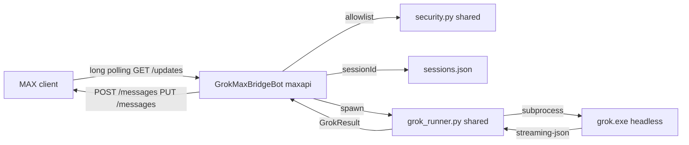

# Grok MAX Bridge — Architecture

Experimental track: remote control of the **local Grok CLI** from MAX messenger.
Not part of the invoice bot runtime.

Official references:
- [API overview](https://dev.max.ru/docs-api) — `platform-api.max.ru`, auth, limits
- [Bot prepare guide](https://dev.max.ru/docs/chatbots/bots-coding/prepare) — token, polling vs webhook

## Goals

1. **Terminal parity** — same `grok.exe`, cwd, model, `--resume`, `--check`, `--always-approve` (shared with TG bridge).
2. **Isolation** — separate token (`GROK_MAX_BRIDGE_TOKEN`), process, data dir (`grok_max_bridge/`), no imports from `app/entrypoints/bot.py`.
3. **Security** — allowlist of MAX `user_id` only.
4. **MAX API compliance** — header auth, long polling for dev, webhook path reserved for production server.

## MAX API alignment (verified 2026-06)

| Requirement (official docs) | Our implementation |
|-----------------------------|-------------------|
| Base URL `https://platform-api.max.ru` | via `maxapi` SDK (`connection/base.py`) |
| Token in header `Authorization: <token>` (not query) | `Bot(token)` → `headers["Authorization"]` |
| Token after bot moderation on [business.max.ru](https://business.max.ru/self) | `GROK_MAX_BRIDGE_TOKEN` in `.env` |
| Long Polling `GET /updates` for dev/test | `dp.start_polling(bot)` |
| Webhook `POST /subscriptions` for production | not used yet; `delete_webhook()` before polling |
| Webhook and polling are mutually exclusive | `await bot.delete_webhook()` in `run()` |
| Max 30 rps to `platform-api.max.ru` | single-user bridge, no burst |
| Message text limit 4000 chars | `split_message(..., limit=3800)` |
| HTML formatting | `format=ParseMode.HTML` |
| Inline keyboard `type: inline_keyboard` | `InlineKeyboardBuilder` + `CallbackButton` |
| Callback answer `POST /answers?callback_id=` | `MessageCallback.answer()` / `.edit()` |
| Events: `message_created`, `message_callback`, `bot_started` | registered in `bot.py` |
| `user_id` for DM replies | `message.sender.user_id`, `send_message(user_id=...)` |
| Python SDK (official fork) | `maxapi` from [max-botapi-python](https://github.com/max-messenger/max-botapi-python) |

## System diagram



## Module map

| Module | Responsibility |
|--------|----------------|
| `config.py` | `GROK_MAX_BRIDGE_*` + shared `GROK_BRIDGE_*` / `GROK_CLI_PATH` |
| `keyboards.py` | MAX `inline_keyboard` with `CallbackButton(payload="act:…")` |
| `bot.py` | Commands, callbacks, Grok runs, resilient polling |
| `agents/METAPROMPT.md` | Bridge rules for MAX channel |
| Shared from `grok_telegram_bridge/` | `grok_runner`, `session_store`, `context_store`, `work_journal`, `formatter`, `security`, `onboarding`, `tester`, `dashboard_hub` |

## CLI command equivalence

Same as Telegram bridge — see `experiments/grok_telegram_bridge/ARCHITECTURE.md`.

| MAX input | CLI flag |
|-----------|----------|
| first text after `/new` | no `--resume` |
| follow-up text | `--resume <sessionId>` |
| YOLO on | `--always-approve` |
| `/check` or button «Проверить» | `--check` |

## Session lifecycle

Storage: `data/private/grok_max_bridge/sessions.json` (gitignored under `data/`).

## Deployment (dev — current)

```powershell
# .env
# GROK_MAX_BRIDGE_TOKEN=   ← after moderation on business.max.ru
# GROK_MAX_BRIDGE_ALLOWED_USER_IDS=<your MAX user_id>

.\.venv\Scripts\python.exe -m experiments.grok_max_bridge
```

Prerequisites ([prepare guide](https://dev.max.ru/docs/chatbots/bots-coding/prepare)):
1. Verified org/IP/self-employed profile on business.max.ru
2. Bot created and passed moderation (status «создан»)
3. Token copied from **Чат-боты → Расширенные настройки → Настроить**
4. PC online, Grok CLI logged in

## Deployment (production — when server is ready)

Per MAX docs, production should use **Webhook only** (`POST /subscriptions`):
- HTTPS endpoint (no HTTP / self-signed after 2026-05-25)
- `update_types` must include `bot_started`, `message_created`, `message_callback`
- Disable long polling on the same bot

Planned as separate infra track (paused until server purchase).

## Failure modes

| Failure | Behavior |
|---------|----------|
| Missing token / allowlist | Exit at startup |
| Unknown user | `Access denied.` |
| Active webhook subscription | `delete_webhook()` on start; maxapi warns if subscriptions remain |
| Grok timeout | Kill subprocess, edit status message |
| Message > 4000 chars | Split into multiple `POST /messages` |
| Network blip | Resilient retry loop in `main()` (5s → 60s backoff) |

## Tests

`tests/test_grok_max_bridge.py` — unit tests (no live MAX API / token required).

Live check after token: bot answers `/start`, buttons work, `GET /me` succeeds via maxapi `check_me`.
