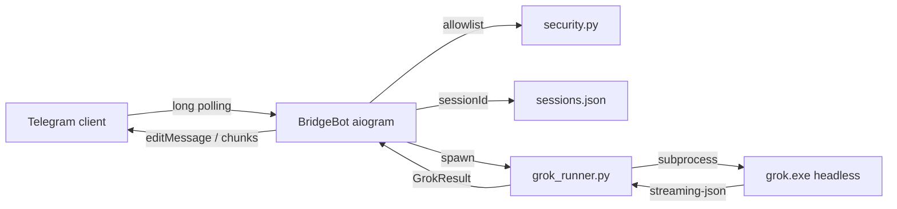

# Grok Telegram Bridge — Architecture

Experimental track: remote control of the **local Grok CLI** from Telegram. Not part of the invoice bot runtime.

## Goals

1. **Terminal parity** — same `grok.exe`, cwd, model, MCP config (`~/.grok/config.toml`), tools, `--resume`, `--check`, `--always-approve`.
2. **Isolation** — separate bot token, process, branch (`exp/grok-telegram-bridge`), no imports from `app/entrypoints/bot.py`.
3. **Security** — allowlist of Telegram `user_id` only; no public access.
4. **Tester** — `/check` and optional auto-check map to Grok CLI `--check` (check-work verifier subagent).

## System diagram



## Module map

| Module | Responsibility |
|--------|----------------|
| `config.py` | `GROK_BRIDGE_*` env vars via pydantic-settings |
| `security.py` | `is_allowed(user_id, allowlist)` |
| `session_store.py` | Persist `sessionId` per user for `--resume` |
| `grok_runner.py` | Build CLI argv, subprocess, parse json / streaming-json |
| `formatter.py` | HTML escape, 4096-char chunking, stream preview |
| `tester.py` | When to append `--check` |
| `bot.py` | Commands, handlers, progress edits |
| `agents/tester.md` | Verifier semantics (documentation) |

## CLI command equivalence

Telegram message → subprocess (simplified):

```text
grok.exe -p "<prompt>" \
  --cwd <GROK_BRIDGE_CWD> \
  -m <GROK_BRIDGE_MODEL> \
  --output-format streaming-json \
  --max-turns <N> \
  --no-auto-update \
  [--resume <sessionId>] \
  [--always-approve] \
  [--check]
```

| Telegram | CLI flag |
|----------|----------|
| first message after `/new` | no `--resume` |
| follow-up text | `--resume <sessionId>` |
| `/yolo on` | `--always-approve` |
| `/check …` or auto-check | `--check` |

## Session lifecycle

1. User sends text → `SessionStore.get(user_id)` → optional `grok_session_id`.
2. `GrokRunner.run(..., session_id=...)` → Grok returns new `sessionId` in JSON/`end` event.
3. `SessionStore.touch_prompt` saves id + increments counter.
4. `/new` → `SessionStore.clear` → next prompt starts fresh session.

Storage: `data/private/grok_bridge/sessions.json` (under gitignored `data/`).

## Streaming UX

With `GROK_BRIDGE_STREAM=true` (default):

- CLI emits NDJSON: `thought`, `text`, `end`.
- Bot edits one status message every 2–4s with tail preview (`formatter.progress_preview`).
- Final answer replaces status; overflow split via `split_message`.

## Tester (verifier)

No custom tester process in the bridge. Verification is delegated to Grok CLI:

- `grok -p "…" --check` spawns a `general-purpose` verifier (check-work skill).
- Triggers: `/check`, `/verify`, keywords «проверь», `GROK_BRIDGE_AUTO_CHECK=true` + code-like prompts.

## Explicitly excluded

| Idea | Reason |
|------|--------|
| Separate MCP server | Grok CLI already loads MCP from user config |
| Cron / scheduled polling | Long-polling bot; chat is event-driven |
| Redis queue | Single-user bridge; subprocess per message is enough |
| Invoice bot coupling | Different token, different entrypoint |

## Deployment

```powershell
# .env: GROK_BRIDGE_BOT_TOKEN, GROK_BRIDGE_ALLOWED_USER_IDS
.\scripts\run_grok_bridge.ps1
# or
.\.venv\Scripts\python.exe -m experiments.grok_telegram_bridge
```

Runs alongside invoice stack (separate process). PC must be on; Grok logged in; Telegram API reachable (single VPN recommended).

## Failure modes

| Failure | Behavior |
|---------|----------|
| Missing token / allowlist | Exit at startup with clear error |
| Unknown user | `Access denied.` |
| Grok timeout (`GROK_BRIDGE_TIMEOUT_SEC`) | Kill subprocess, show error in TG |
| Empty / invalid JSON | `GrokRunnerError` → user message |
| Message > 4096 chars | Split into multiple replies |

## Tests

`tests/test_grok_bridge.py` — unit tests for formatter, security, sessions, cmd builder, tester triggers.

Integration with live `grok.exe` is manual (requires auth + network).
